# Squeezelite — Comprehensive Project Analysis

> **Version analyzed:** 2.0.0-1556  
> **Original authors:** Adrian Smith (2012–2015), Ralph Irving (2015–2025)  
> **License:** GNU GPLv3 (with OpenSSL linking exception)  
> **Language:** C (with a small C++ wrapper for ALAC)

---

## Table of Contents

1. [Project Overview](#1-project-overview)
2. [High-Level Architecture](#2-high-level-architecture)
3. [Directory & File Layout](#3-directory--file-layout)
4. [Core Subsystems](#4-core-subsystems)
   - 4.1 [Main Entry Point (`main.c`)](#41-main-entry-point-mainc)
   - 4.2 [SlimProto Protocol Engine (`slimproto.c`, `slimproto.h`)](#42-slimproto-protocol-engine-slimprotoc-slimprotoh)
   - 4.3 [Stream Module (`stream.c`)](#43-stream-module-streamc)
   - 4.4 [Decode Module (`decode.c`)](#44-decode-module-decodec)
   - 4.5 [Output Module (`output.c`)](#45-output-module-outputc)
   - 4.6 [Ring Buffer (`buffer.c`)](#46-ring-buffer-bufferc)
   - 4.7 [Utilities (`utils.c`)](#47-utilities-utilsc)
5. [Audio Codec Plugins](#5-audio-codec-plugins)
6. [Output Backends](#6-output-backends)
7. [Optional Feature Modules](#7-optional-feature-modules)
   - 7.1 [DSD Support (`dsd.c`, `dop.c`, `dsd2pcm/`)](#71-dsd-support-dsdc-dopc-dsd2pcm)
   - 7.2 [Resampling (`resample.c`, `process.c`)](#72-resampling-resamplec-processc)
   - 7.3 [GPIO / Relay Control (`gpio.c`)](#73-gpio--relay-control-gpioc)
   - 7.4 [IR Remote (`ir.c`)](#74-ir-remote-irc)
   - 7.5 [Visualiser Export (`output_vis.c`)](#75-visualiser-export-output_visc)
   - 7.6 [SSL/TLS (`sslsym.c`)](#76-ssltls-sslsymc)
8. [Build System](#8-build-system)
9. [Platform Support Matrix](#9-platform-support-matrix)
10. [Threading Model](#10-threading-model)
11. [Data Flow — End to End](#11-data-flow--end-to-end)
12. [State Machines](#12-state-machines)
13. [Dynamic Library Loading Strategy](#13-dynamic-library-loading-strategy)
14. [Configuration & Command-Line Options](#14-configuration--command-line-options)
15. [Packet Protocol Reference](#15-packet-protocol-reference)
16. [Key Design Patterns](#16-key-design-patterns)
17. [Ancillary Files & Resources](#17-ancillary-files--resources)

---

## 1. Project Overview

**Squeezelite** is a lightweight, headless audio player that emulates a Logitech Squeezebox hardware device. It connects to a **Logitech Media Server (LMS)** using the proprietary **SlimProto** TCP protocol, receives audio streams over HTTP/HTTPS, decodes them, and plays them through the local audio subsystem.

### Key Characteristics

| Property | Detail |
|---|---|
| Written in | C99 (one C++ file for ALAC wrapper) |
| Total source lines | ~15 400 (`.c` / `.cpp` / `.h`) |
| Primary use case | Headless hi-fi audio player for LMS |
| Supported codecs | FLAC, PCM/WAV/AIFF, Vorbis (OGG), AAC (FAAD), MP3 (MAD / mpg123), Opus, ALAC, WMA (FFmpeg), DSD |
| Audio outputs | ALSA, PulseAudio, PortAudio, stdout (raw PCM) |
| Platforms | Linux (x86, ARM, PPC, Solaris), macOS, Windows, FreeBSD, OpenBSD |

---

## 2. High-Level Architecture

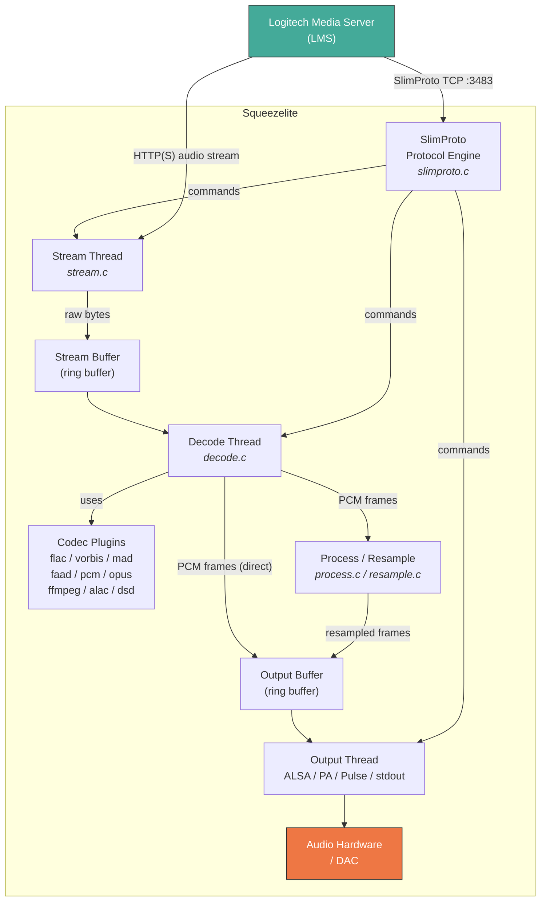

The architecture follows a **pipeline model** with three main threads connected by two ring buffers:

1. **Stream Thread** — fetches audio data from the network (HTTP/HTTPS) or local files into the **stream buffer**.
2. **Decode Thread** — reads compressed data from the stream buffer, decodes it using the appropriate codec plugin, and writes PCM samples into the **output buffer**.
3. **Output Thread** — reads PCM frames from the output buffer and writes them to the audio device.

A fourth logical component, the **SlimProto Protocol Engine**, runs in the main thread and orchestrates everything by communicating with LMS.

---

## 3. Directory & File Layout

```
squeezelite/
├── squeezelite.h          # Master header — types, config, all module APIs
├── slimproto.h             # SlimProto packet structure definitions
├── main.c                  # Entry point, CLI parsing, initialization
├── slimproto.c             # SlimProto protocol engine (server communication)
├── stream.c                # Stream thread — HTTP(S)/file fetching
├── decode.c                # Decode thread — codec orchestration
├── buffer.c                # Circular (ring) buffer implementation
├── output.c                # Common output logic (fade, gain, track changes)
├── output_alsa.c           # ALSA output backend
├── output_pa.c             # PortAudio output backend
├── output_pulse.c          # PulseAudio output backend
├── output_stdout.c         # Raw PCM to stdout
├── output_pack.c           # Sample scaling, packing, crossfade, gain
├── output_vis.c            # Shared-memory visualiser export
├── utils.c                 # Logging, networking, MAC addr, clock, etc.
├── flac.c                  # FLAC codec plugin
├── pcm.c                   # Raw PCM / WAV / AIFF codec plugin
├── vorbis.c                # Ogg Vorbis codec plugin (+ Tremor support)
├── mad.c                   # MP3 decoder (libmad)
├── mpg.c                   # MP3 decoder (libmpg123)
├── faad.c                  # AAC decoder (FAAD2) + MP4 container parser
├── opus.c                  # Opus codec plugin
├── ffmpeg.c                # FFmpeg-based decoder (WMA, ALAC fallback)
├── alac.c                  # Apple Lossless (ALAC) native decoder
├── alac_wrapper.cpp        # C++ wrapper for Apple ALAC library
├── alac_wrapper.h          # ALAC wrapper header
├── dsd.c                   # DSD stream decoder (DSF/DFF)
├── dop.c                   # DSD-over-PCM (DoP) handling
├── dsd2pcm/                # Sebastian Gesemann's dsd2pcm conversion library
│   ├── dsd2pcm.c
│   ├── dsd2pcm.h
│   └── LICENSE.txt
├── resample.c              # libsoxr-based resampling
├── process.c               # Sample processing pipeline wrapper
├── gpio.c                  # Raspberry Pi GPIO relay control (libgpiod)
├── minimal_gpio.c          # Minimal GPIO (deprecated/alternative)
├── ir.c                    # LIRC infrared remote control
├── sslsym.c                # Dynamic loading of OpenSSL symbols
├── daemonize.c             # Daemonization helper (Solaris)
├── Makefile                # Primary Makefile (GNU Make)
├── Makefile.*              # Platform-specific Makefiles (14 variants)
├── squeezelite*.sln        # Visual Studio solutions (Windows)
├── squeezelite*.vcproj     # Visual Studio project files (Windows)
├── squeezelite*.vcxproj    # Visual Studio 2010+ project files
├── doc/
│   └── squeezelite.1       # Man page
├── tools/
│   ├── alsacap.c           # ALSA capability query utility
│   ├── find_servers.c      # LMS server discovery tool
│   ├── gpiopower.sh        # GPIO power control script
│   ├── lircd.conf          # LIRC daemon config
│   ├── lircrc              # LIRC client config
│   └── setrpath.c          # RPATH setter utility
├── alpine/                 # Alpine Linux packaging
│   ├── APKBUILD
│   ├── squeezelite.confd
│   ├── squeezelite.initd
│   └── squeezelite.pre-install
├── rsc/                    # Icon resources
│   ├── app.bmp / icon.icns / jiveapp.icns / jiveapp.ico
├── README.md
└── LICENSE.txt
```

---

## 4. Core Subsystems

### 4.1 Main Entry Point (`main.c`)

**866 lines** — Responsible for:

- Parsing all command-line arguments (custom parser, not `getopt`)
- Setting log levels for each subsystem (`slimproto`, `stream`, `decode`, `output`, `ir`)
- Initializing all subsystems in order: `stream_init` → `output_init_*` → `dsd_init` → `decode_init` → `process_init` → `ir_init`
- Installing signal handlers (`SIGINT`, `SIGTERM`, `SIGQUIT`, `SIGHUP`)
- Calling `slimproto()` which blocks until shutdown
- Tearing down in reverse order

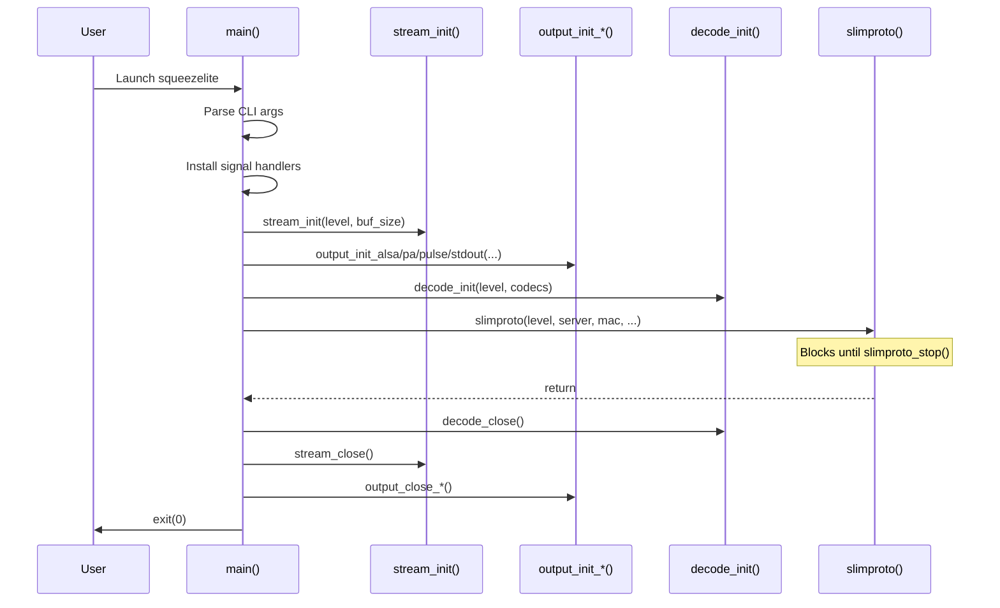

### 4.2 SlimProto Protocol Engine (`slimproto.c`, `slimproto.h`)

**984 lines** — The heart of the player. Implements the **SlimProto** binary TCP protocol to communicate with LMS.

#### Key Functions

| Function | Purpose |
|---|---|
| `slimproto()` | Main loop — connects to server, sends HELO, enters `slimproto_run()` |
| `slimproto_run()` | Event loop — processes server commands, monitors state, sends status |
| `discover_server()` | UDP broadcast discovery of LMS on port 3483 |
| `sendHELO()` | Sends player identification and capabilities |
| `sendSTAT()` | Sends player status (buffer levels, elapsed time, etc.) |
| `process_strm()` | Handles `strm` (stream) commands: start, stop, pause, unpause, flush |
| `process_audg()` | Handles volume/gain changes |
| `process_serv()` | Handles server switching |

#### Protocol Packets (defined in `slimproto.h`)

All packets are packed structs with big-endian fields:

| Direction | Opcode | Struct | Purpose |
|---|---|---|---|
| Player → Server | `HELO` | `HELO_packet` | Player identification, MAC, capabilities |
| Player → Server | `STAT` | `STAT_packet` | Status report (buffer levels, elapsed time) |
| Player → Server | `DSCO` | `DSCO_packet` | Disconnect notification |
| Player → Server | `RESP` | `RESP_header` | HTTP response headers relay |
| Player → Server | `META` | `META_header` | Stream metadata relay |
| Player → Server | `SETD` | `SETD_header` | Device settings (e.g., player name) |
| Player → Server | `IR  ` | `IR_packet` | IR remote code |
| Server → Player | `strm` | `strm_packet` | Stream control (start/stop/pause/flush) |
| Server → Player | `audg` | `audg_packet` | Audio gain/volume |
| Server → Player | `aude` | `aude_packet` | Audio enable/disable |
| Server → Player | `cont` | `cont_packet` | Continue streaming (metadata interval) |
| Server → Player | `serv` | `serv_packet` | Switch server |
| Server → Player | `setd` | `setd_packet` | Set device parameter |
| Server → Player | `codc` | `codc_packet` | Codec open (deferred codec detection) |

### 4.3 Stream Module (`stream.c`)

**978 lines** — Runs a dedicated thread that:

1. Connects to the audio source (HTTP/HTTPS socket or local file)
2. Sends HTTP request headers
3. Receives and parses HTTP response headers
4. Streams audio data into the **stream buffer** ring buffer
5. Handles ICY metadata extraction
6. Handles Ogg metadata (vorbis comments) extraction with optional `libogg`
7. Supports SSL/TLS via OpenSSL

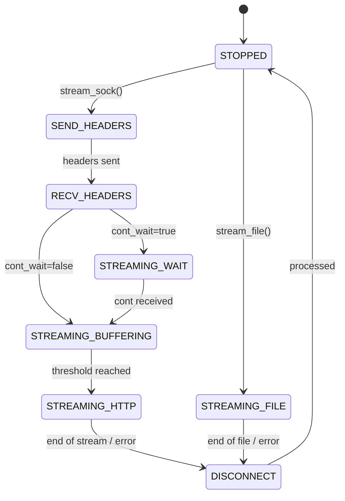

### 4.4 Decode Module (`decode.c`)

**314 lines** — Runs a dedicated thread that:

1. Reads compressed data from the **stream buffer**
2. Delegates to the appropriate codec plugin based on format character
3. The codec writes decoded PCM frames into the **output buffer** (or the process buffer if resampling)
4. Manages codec registration, sorting by priority, and opening/closing

#### Codec Registration Pattern

Each codec is a struct with function pointers:

```c
struct codec {
    char id;                    // format identifier ('f'=FLAC, 'o'=Vorbis, etc.)
    char *types;                // capability string for HELO
    unsigned min_read_bytes;    // minimum bytes needed in stream buffer
    unsigned min_space;         // minimum space needed in output buffer
    void (*open)(...);          // initialize decoder for new stream
    void (*close)(void);        // cleanup decoder
    decode_state (*decode)(void); // decode one chunk, return state
};
```

### 4.5 Output Module (`output.c`)

**466 lines** — Common output logic shared across all backends:

- **Track start detection** — identifies track boundaries in the output buffer
- **Fade handling** — supports fade-in, fade-out, fade-in-out, and crossfade between tracks
- **Gain/volume** — applies replay gain and volume adjustments
- **Output state machine** — manages buffer, running, paused, skip, start-at states

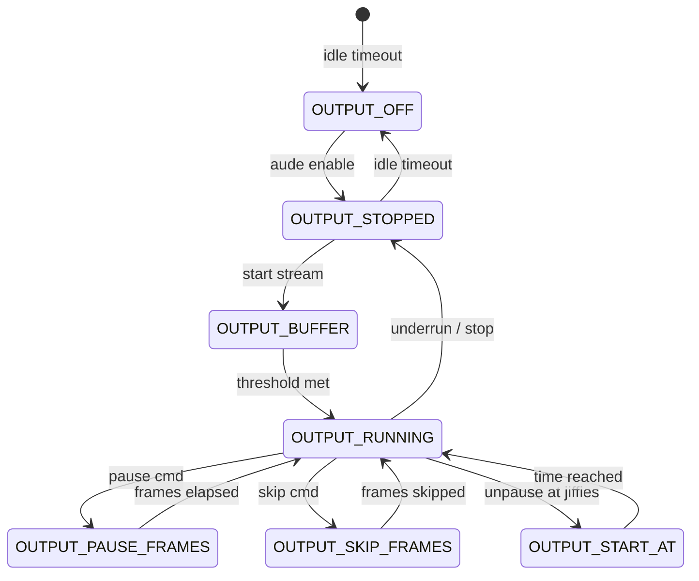

### 4.6 Ring Buffer (`buffer.c`)

**168 lines** — A lock-protected circular buffer used for both stream and output buffers.

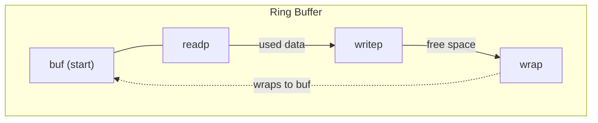

Key operations:
- `_buf_used()` / `_buf_space()` — query fill level
- `_buf_cont_read()` / `_buf_cont_write()` — contiguous bytes available without wrap
- `_buf_inc_readp()` / `_buf_inc_writep()` — advance pointers with wrap-around
- `_buf_unwrap()` — make data contiguous (for codecs that need it)
- `_buf_resize()` — resize buffer (used for crossfade support)
- All `_*` functions are called with the mutex held

### 4.7 Utilities (`utils.c`)

**535 lines** — Cross-platform utility functions:

| Category | Functions |
|---|---|
| Logging | `logtime()`, `logprint()` |
| CLI parsing | `next_param()` |
| Clock | `gettime_ms()` — monotonic millisecond clock |
| Networking | `get_mac()`, `set_nonblock()`, `connect_timeout()`, `server_addr()` |
| Event handling | `set_readwake_handles()`, `wait_readwake()` |
| Byte order | `packN()`, `packn()`, `unpackN()`, `unpackn()` |
| Platform shims | `winsock_init()`, `dlopen()` (Windows), `poll()` (Windows), `strcasestr()` (Windows/Solaris) |

---

## 5. Audio Codec Plugins

Each codec follows the same pattern: a `register_*()` function that returns a `struct codec` with function pointers and optionally dynamically loads the library.

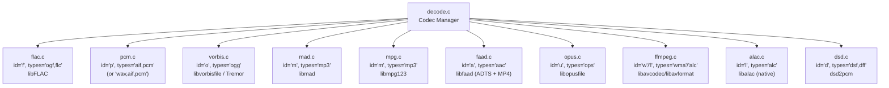

### Codec Details

| File | ID | Types | Library | Min Read | Min Space | Notes |
|---|---|---|---|---|---|---|
| `flac.c` | `'f'` | `ogf,flc` | libFLAC | 16 384 | 204 800 | OGG/FLAC + chaining (≥1.5) |
| `pcm.c` | `'p'` | `aif,pcm` | (built-in) | 4 096 | 102 400 | WAV/AIFF header parser |
| `vorbis.c` | `'o'` | `ogg` | libvorbisfile / libvorbisidec | 4 096 | 20 480 | Auto-selects Tremor at runtime |
| `mad.c` | `'m'` | `mp3` | libmad | 2 048 | 206 800 | LAME gapless support |
| `mpg.c` | `'m'` | `mp3` | libmpg123 | 2 048 | 206 800 | Alternative MP3 decoder |
| `faad.c` | `'a'` | `aac` | libfaad2 | 2 048 | 20 480 | ADTS + MP4 container parsing |
| `opus.c` | `'u'` | `ops` | libopusfile | 4 096 | 32 768 | Always 48 kHz output |
| `ffmpeg.c` | varies | `wma,alc` | libavformat/avcodec/avutil | 2 048 | 204 800 | WMA + ALAC fallback |
| `alac.c` | `'l'` | `alc` | libalac | 4 096 | 102 400 | Native Apple ALAC via C++ wrapper |
| `dsd.c` | `'d'` | `dsf,dff` | dsd2pcm | 16 384 | 204 800 | DSD64/128/256/512 |

---

## 6. Output Backends

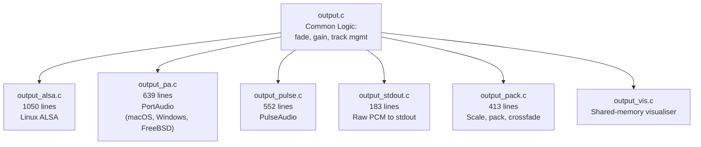

### Backend Details

| Backend | File | Platform | Features |
|---|---|---|---|
| **ALSA** | `output_alsa.c` | Linux | mmap/write modes, hardware mixer control, real-time thread priority, DSD native output |
| **PortAudio** | `output_pa.c` | macOS, Windows, FreeBSD, Solaris | Cross-platform, WASAPI exclusive mode (Windows), host API selection |
| **PulseAudio** | `output_pulse.c` | Linux | PulseAudio simple API, dynamic sample rate changes |
| **stdout** | `output_stdout.c` | All | Outputs raw interleaved PCM (16/24/32-bit little-endian) |

### Output Format Support

| Format | Enum | Bits | DSD-specific |
|---|---|---|---|
| `S32_LE` | 0 | 32-bit signed LE | No |
| `S24_LE` | 1 | 24-bit in 32-bit LE | No |
| `S24_3LE` | 2 | 24-bit packed LE | No |
| `S16_LE` | 3 | 16-bit signed LE | No |
| `U8` | 4 | 8-bit unsigned | DSD |
| `U16_LE/BE` | 5–6 | 16-bit unsigned | DSD |
| `U32_LE/BE` | 7–8 | 32-bit unsigned | DSD |

---

## 7. Optional Feature Modules

### 7.1 DSD Support (`dsd.c`, `dop.c`, `dsd2pcm/`)

**930 lines** (dsd.c) — Decodes DSD streams (DSF and DFF containers) and can:

- Convert DSD to PCM using the bundled `dsd2pcm` library (by Sebastian Gesemann)
- Output DSD over PCM (DoP) markers
- Output native DSD in various formats (U8, U16LE/BE, U32LE/BE)
- Handle DSD64, DSD128, DSD256, DSD512 rates

### 7.2 Resampling (`resample.c`, `process.c`)

- **`process.c`** (194 lines) — Provides a generic sample processing wrapper with input/output buffers
- **`resample.c`** (367 lines) — Uses **libsoxr** for high-quality resampling with configurable quality recipes (Very High, High, Medium, Low, Quick)

### 7.3 GPIO / Relay Control (`gpio.c`)

**185 lines** — Raspberry Pi amplifier power control:
- Uses **libgpiod** (v2 API) for GPIO line control
- Configurable chip, pin, and active-high/low polarity
- Alternative: run a user-specified power control script

### 7.4 IR Remote (`ir.c`)

**295 lines** — Linux-only LIRC-based infrared remote control:
- Maps LIRC codes to Squeezebox IR codes
- Supports both `.lircrc` config-based mapping and automatic LIRC namespace key mapping
- Sends IR codes to LMS via `IR` packets

### 7.5 Visualiser Export (`output_vis.c`)

Exports audio data via POSIX shared memory for external visualiser applications.

### 7.6 SSL/TLS (`sslsym.c`)

**174 lines** — Dynamic loading of OpenSSL symbols at runtime (when `USE_SSL` is enabled and `LINKALL` is not set), allowing HTTPS streaming without compile-time OpenSSL dependency.

---

## 8. Build System

The build system uses **GNU Make** with a primary `Makefile` and 14 platform-specific `Makefile.*` wrappers.

### Feature Flags (compile-time `-D` options)

| Flag | Makefile OPT | Effect |
|---|---|---|
| `DSD` | `OPT_DSD` | DSD decoder and DoP support |
| `FFMPEG` | `OPT_FF` | FFmpeg-based decoder |
| `ALAC` | `OPT_ALAC` | Native Apple ALAC decoder |
| `OPUS` | `OPT_OPUS` | Opus decoder |
| `RESAMPLE` | `OPT_RESAMPLE` | libsoxr resampling |
| `VISEXPORT` | `OPT_VIS` | Shared-memory visualiser |
| `IR` | `OPT_IR` | LIRC remote control |
| `GPIO` | `OPT_GPIO` | GPIO relay control |
| `RPI` | `OPT_RPI` | Raspberry Pi (implies GPIO) |
| `LINKALL` | `OPT_LINKALL` | Link all libs at compile time |
| `USE_SSL` | `OPT_SSL` | HTTPS streaming support |
| `NO_SSLSYM` | `OPT_NOSSLSYM` | Link SSL directly (don't dlopen) |
| `PORTAUDIO` | `OPT_PORTAUDIO` | PortAudio output backend |
| `PULSEAUDIO` | `OPT_PULSEAUDIO` | PulseAudio output backend |
| `NO_FAAD` | `OPT_NO_FAAD` | Exclude AAC decoder |
| `NO_MAD` | `OPT_NO_MAD` | Exclude MAD MP3 decoder |
| `NO_MPG123` | `OPT_NO_MPG123` | Exclude mpg123 MP3 decoder |
| `USE_LIBOGG` | — | Use libogg for Ogg metadata |

### Platform Makefiles

```mermaid
graph TD
    M["Makefile<br/>(primary)"]
    
    M --> MX86["Makefile.x86_64<br/>macOS x86_64"]
    M --> MM1["Makefile.m1<br/>macOS ARM64"]
    M --> MOSX["Makefile.osx<br/>macOS universal"]
    M --> MRPI["Makefile.rpi<br/>Raspberry Pi ARM"]
    M --> MARM["Makefile.armel<br/>ARM LE (generic)"]
    M --> MPPC["Makefile.ppc<br/>PowerPC 32-bit"]
    M --> MPPC64["Makefile.ppc64<br/>PowerPC 64-bit"]
    M --> MI386["Makefile.i386<br/>Linux i386"]
    M --> MFREE["Makefile.freebsd<br/>FreeBSD"]
    M --> MSUN["Makefile.sun<br/>Solaris/illumos"]
    M --> MPA["Makefile.pa<br/>PortAudio (Linux)"]
    M --> MPAOSS["Makefile.paoss<br/>PortAudio + OSS"]
    M --> MPULSE["Makefile.pulse<br/>PulseAudio"]
    M --> MRES["Makefile.resample<br/>With resampling"]
```

### Windows Build

Uses Visual Studio solution files:
- `squeezelite.sln` / `squeezelite.vcproj` — 32-bit
- `squeezelite-x64.sln` / `squeezelite-x64.vcxproj` — 64-bit
- `squeezelite-dll.sln` — DLL variant
- `squeezelite-ffmpeg-x64.sln` — with FFmpeg

---

## 9. Platform Support Matrix

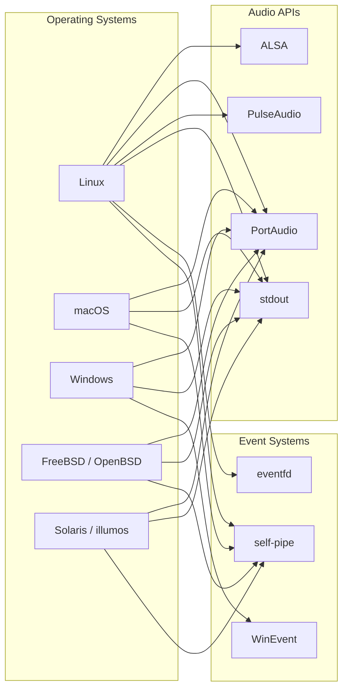

| Feature | Linux | macOS | Windows | FreeBSD | Solaris |
|---|:---:|:---:|:---:|:---:|:---:|
| ALSA output | ✅ | — | — | — | — |
| PortAudio | ✅ | ✅ | ✅ | ✅ | ✅ |
| PulseAudio | ✅ | — | — | — | — |
| Daemonize | ✅ | — | — | ✅ | ✅ |
| GPIO/RPI | ✅ | — | — | — | — |
| IR (LIRC) | ✅ | — | — | — | — |
| Visualiser | ✅ | ✅ | — | — | — |
| DSD native | ✅ (ALSA) | — | — | — | — |

---

## 10. Threading Model

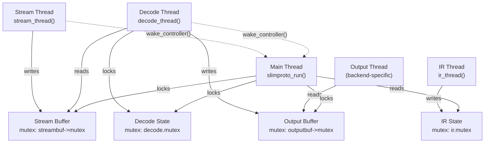

### Synchronisation

- **Mutexes**: Each buffer has its own mutex; decode state has a separate mutex; IR state has a separate mutex
- **Priority inheritance**: Buffer mutexes are created with `PTHREAD_PRIO_INHERIT` on POSIX systems
- **Wake mechanism**: Threads signal the main thread via `wake_controller()` using platform-specific events (eventfd / self-pipe / Windows event)
- **Lock ordering**: Always `S` → `D` → `O` to prevent deadlocks

### Thread Stack Sizes

| Thread | Stack Size |
|---|---|
| Stream | 64 KB |
| Decode | 128 KB |
| Output | 64 KB |
| IR | 64 KB |

---

## 11. Data Flow — End to End

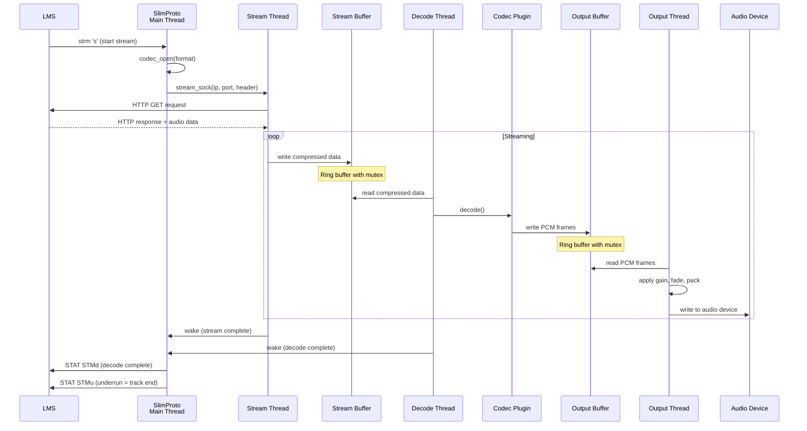

### Buffer Sizes (defaults)

| Buffer | Default Size | Notes |
|---|---|---|
| Stream buffer | 2 MB (`STREAMBUF_SIZE`) | Holds compressed audio data |
| Output buffer | ~3.5 MB (`44100 × 8 × 10`) | Holds ~10 seconds of 32-bit stereo 44.1 kHz PCM |
| Output crossfade | ~4.2 MB (120% of output) | Extended buffer when crossfade is active |

---

## 12. State Machines

### Stream States

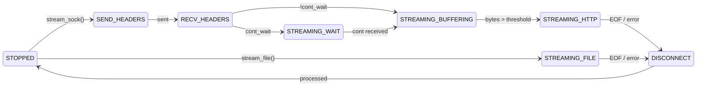

### Decode States

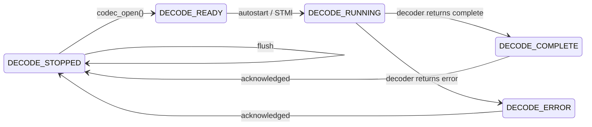

### Output States

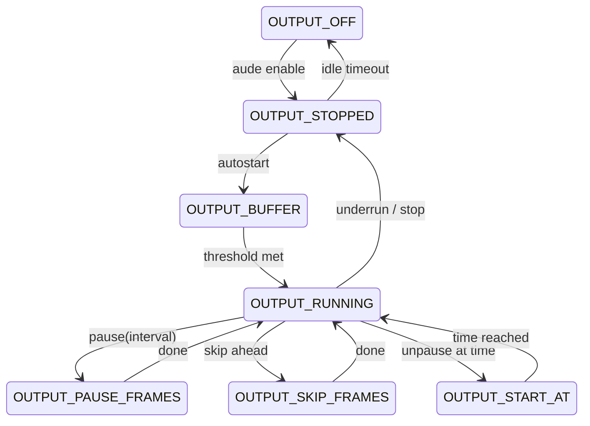

---

## 13. Dynamic Library Loading Strategy

When `LINKALL` is **not** defined, squeezelite loads codec libraries at runtime using `dlopen()`/`dlsym()`. This allows the binary to run even if some libraries are missing — it simply won't support those codecs.

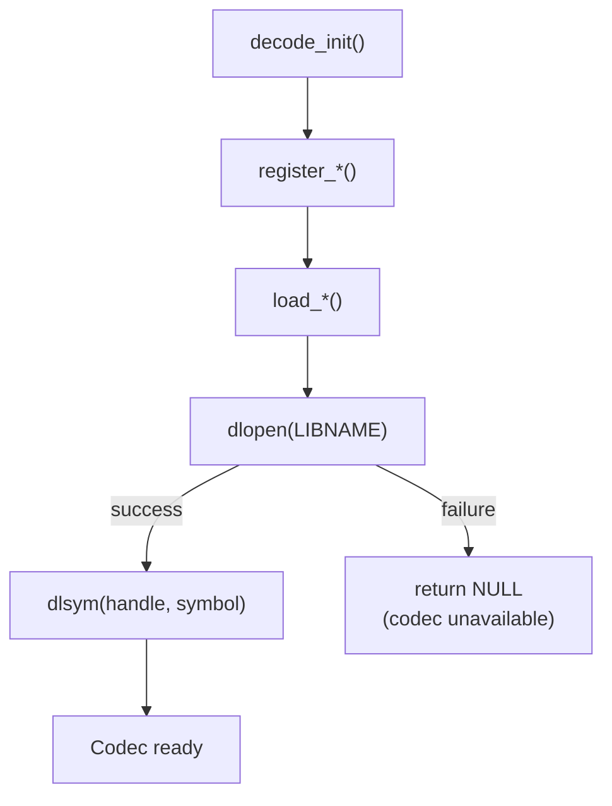

### Library Names (Linux)

| Codec | Library Pattern |
|---|---|
| FLAC | `libFLAC.so.%d` (versioned) |
| MAD | `libmad.so.0` |
| mpg123 | `libmpg123.so.0` |
| Vorbis | `libvorbisfile.so.3` |
| Tremor | `libvorbisidec.so.1` |
| FAAD | `libfaad.so.2` |
| Opus | `libopusfile.so.0` |
| FFmpeg | `libavutil.so.%d`, `libavcodec.so.%d`, `libavformat.so.%d` |
| soxr | `libsoxr.so.0` |
| LIRC | `liblirc_client.so.0` |
| Ogg | `libogg.so.0` |

---

## 14. Configuration & Command-Line Options

| Option | Argument | Description |
|---|---|---|
| `-s` | `server[:port]` | LMS server address (default: auto-discover) |
| `-o` | `device` | Output device (`default`, `-` for stdout) |
| `-l` | — | List output devices |
| `-a` | params | Audio output parameters (backend-specific) |
| `-b` | `stream:output` | Buffer sizes in KB |
| `-c` | `codec1,codec2` | Include only specified codecs |
| `-e` | `codec1,codec2` | Exclude specified codecs |
| `-C` | `timeout` | Close output device when idle (seconds) |
| `-d` | `log=level` | Set logging (`slimproto\|stream\|decode\|output\|ir\|all`=`info\|debug\|sdebug`) |
| `-f` | `logfile` | Write debug to logfile |
| `-m` | `mac` | Set MAC address |
| `-M` | `modelname` | Set model name reported to server |
| `-n` | `name` | Set player name |
| `-N` | `filename` | Store player name in file |
| `-r` | `rates[:delay]` | Supported sample rates |
| `-p` | `priority` | Output thread RT priority (1–99, ALSA only) |
| `-P` | `pidfile` | PID file (Linux/FreeBSD/Solaris) |
| `-z` | — | Daemonize |
| `-Z` | `rate` | Report max sample rate to server |
| `-W` | — | Read WAV/AIFF headers from stream |
| `-D` | `[delay[:format]]` | Enable DSD output |
| `-R`/`-u` | `[params]` | Enable resampling |
| `-v` | — | Enable visualiser export |
| `-i` | `[lircrc]` | Enable LIRC IR |
| `-G` | `chip:pin:H\|L` | GPIO relay control (RPI) |
| `-S` | `script` | Power control script (GPIO) |
| `-V` | `control` | ALSA volume control |
| `-U` | `control` | ALSA unmute control |
| `-O` | `device` | ALSA mixer device |
| `-L` | — | List ALSA volume controls |
| `-X` | — | Linear volume adjustments |
| `-t` | — | Show license terms |
| `-?` | — | Show help |

---

## 15. Packet Protocol Reference

### HELO Capabilities String

The player sends a capabilities string in the HELO packet that tells the server what it supports:

```
Model=squeezelite,AccuratePlayPoints=1,HasDigitalOut=1,
HasPolarityInversion=1,Balance=1,Firmware=2.0.0-1556,
ModelName=SqueezeLite,MaxSampleRate=192000,
ogf,flc,ogg,aac,mp3,aif,pcm
```

### STAT Events

| Event Code | Meaning |
|---|---|
| `STMc` | Connect — stream connected |
| `STMd` | Decoder finished |
| `STMf` | Flushed |
| `STMl` | Decoder ready (autostart=0) |
| `STMn` | Decoder error |
| `STMo` | Output buffer underrun (while streaming) |
| `STMp` | Paused |
| `STMr` | Resumed |
| `STMs` | Track started playing |
| `STMt` | Timer heartbeat (every ~1 second during playback) |
| `STMu` | Underrun (output empty, decode complete) |

### strm Commands

| Command | Description |
|---|---|
| `s` | Start new stream |
| `t` | Timestamp query |
| `q` | Stop and flush |
| `f` | Flush (streaming may continue) |
| `p` | Pause (with optional interval) |
| `u` | Unpause (with optional start-at time) |
| `a` | Skip ahead |

---

## 16. Key Design Patterns

### 1. Conditional Compilation

The entire codebase uses extensive `#if` / `#ifdef` preprocessor guards for feature selection and platform abstraction. Example:

```c
#if ALSA
void output_init_alsa(...);
#endif
#if PORTAUDIO
void output_init_pa(...);
#endif
```

### 2. Dynamic Library Loading

A unified pattern across all codecs:

```c
#if LINKALL
#define FLAC(h, fn, ...) (FLAC__ ## fn)(__VA_ARGS__)
#else
#define FLAC(h, fn, ...) (h)->FLAC__##fn(__VA_ARGS__)
#endif
```

This allows the same code to work with both compile-time and runtime linking.

### 3. Platform Abstraction Macros

Threading, mutexes, sockets, and events are all abstracted through macros in `squeezelite.h`:

```c
// Threading
#define mutex_type pthread_mutex_t       // POSIX
#define mutex_type HANDLE                // Windows

// Wake events
#define wake_create(e) e = eventfd(0,0)  // Linux eventfd
#define wake_create(e) pipe(e.fds)       // POSIX self-pipe
#define wake_create(e) e = CreateEvent() // Windows
```

### 4. Lock Macros

Consistent lock/unlock macros throughout:

```c
#define LOCK_S   mutex_lock(streambuf->mutex)
#define UNLOCK_S mutex_unlock(streambuf->mutex)
#define LOCK_O   mutex_lock(outputbuf->mutex)
#define UNLOCK_O mutex_unlock(outputbuf->mutex)
#define LOCK_D   mutex_lock(decode.mutex)
#define UNLOCK_D mutex_unlock(decode.mutex)
```

### 5. Process/Direct Decode Path

When resampling is enabled, decoded frames go through a process buffer. The `IF_DIRECT` / `IF_PROCESS` macros handle this transparently:

```c
IF_DIRECT(
    optr = (ISAMPLE_T *)outputbuf->writep;
    f = min(_buf_space(outputbuf), _buf_cont_write(outputbuf)) / BYTES_PER_FRAME;
);
IF_PROCESS(
    optr = (ISAMPLE_T *)process.inbuf;
    f = process.max_in_frames;
);
```

---

## 17. Ancillary Files & Resources

### Tools (`tools/`)

| File | Purpose |
|---|---|
| `alsacap.c` | Query ALSA device capabilities |
| `find_servers.c` | Discover LMS servers on the network |
| `gpiopower.sh` | Shell script for GPIO power control |
| `lircd.conf` | LIRC daemon configuration for Squeezebox remote |
| `lircrc` | LIRC client configuration mapping |
| `setrpath.c` | Utility to set RPATH in ELF binaries |

### Alpine Linux Packaging (`alpine/`)

Complete packaging for Alpine Linux including init script, config, and APKBUILD.

### Resources (`rsc/`)

Application icons in various formats (BMP, ICNS, ICO) for desktop and embedded use.

### Documentation (`doc/`)

- `squeezelite.1` — Comprehensive man page covering all command-line options

---

*Analysis generated from the squeezelite source code (version 2.0.0-1556).*
